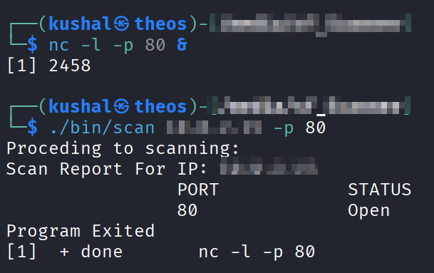
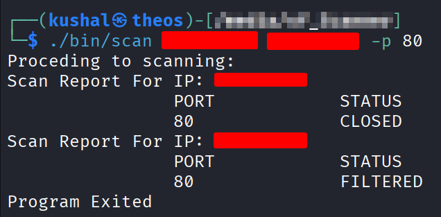

# 🔍 CRecon — A TCP Port Scanner in C

> Built from scratch in C as part of a journey into cybersecurity and low-level network programming.

---

## About

CRecon is a lightweight TCP port scanner written in pure C. It resolves hostnames via DNS, connects to target ports using raw sockets, and classifies each port as Open, Closed, or Filtered — similar to how tools like `nmap` work under the hood.

This project was built to understand the fundamentals of:
- Raw socket programming
- DNS resolution with `getaddrinfo`
- Network reconnaissance techniques
- Memory management in C

---

## Screenshots

**Open Ports Detected**


**Multiple Targets**


---

## Features

- Scan single or multiple targets (IP or hostname)
- Resolves hostnames to all mapped IPs automatically
- Classifies ports as `OPEN`, `CLOSED`, or `FILTERED`
- Configurable port ranges via `-p` flag (default: top 1024)
- Clean scan report output per IP

---

## Usage

```bash
# Single target
./crecon 192.168.1.1

# Multiple targets
./crecon google.com 192.168.1.1

# Specific ports
./crecon 192.168.1.1 -p 80 443

# Port range
./crecon 192.168.1.1 -p 1-1024
```

---

## Build

```bash
git clone https://github.com/Kshitij-jj/CRecon
cd C
make
```

**Dependencies:** None — pure POSIX C, standard libraries only.

**Tested on:** Linux (Kali)

---

## Project Structure

```
C/
├── src/
│   ├── main.c        # Entry point, scan loop
│   ├── scanner.c     # TCP connect scan logic
│   ├── input.c       # Argument parsing, DNS resolution
│   ├── output.c      # Scan report printing
│   └── helper.c      # Memory cleanup, port utilities
├── include/
│   ├── common.h      # Shared structs, enums, defines
│   ├── scanner.h
│   ├── input.h
│   ├── output.h
│   └── helper.h
└── Makefile
```

---

## How It Works

CRecon uses **TCP Connect Scanning** — the same technique used by nmap's `-sT` flag:

1. Creates a TCP socket per port
2. Attempts `connect()` to target IP:port
3. Classifies result:
   - Connection success → `OPEN`
   - `ECONNREFUSED` → `CLOSED`
   - `ETIMEDOUT` / `EHOSTUNREACH` → `FILTERED`

```
Target → DNS Resolution → IP List → TCP Connect per Port → Report
```

---

## Roadmap

- [x] Single target scanning
- [x] Multiple target scanning
- [x] Custom port ranges via `-p` flag
- [ ] HTML report output
- [ ] Multithreaded scanning (thread pool)
- [ ] Non-blocking sockets
- [ ] Banner grabbing (service detection)
- [ ] UDP scan support
- [ ] OS fingerprinting

---

## Legal Disclaimer

> This tool is intended for **educational purposes** and **authorized penetration testing only**.
> Scanning systems without explicit permission is **illegal** and unethical.
> Always obtain written permission before scanning any network or system you do not own.

---

## Author

**Kshitij** — Built as a learning project while diving deep into cybersecurity, network programming, and C systems development.

> *"To understand security tools, you must build them yourself."*

---

## Learning Resources

- [Beej's Guide to Network Programming](https://beej.us/guide/bgnet/)
- [Nmap — The Art of Port Scanning](https://nmap.org/book/toc.html)
- [TCP/IP Illustrated — W. Richard Stevens](https://www.amazon.com/TCP-Illustrated-Protocols-Addison-Wesley-Professional/dp/0321336313)
- [The Linux Programming Interface](https://man7.org/tlpi/)
