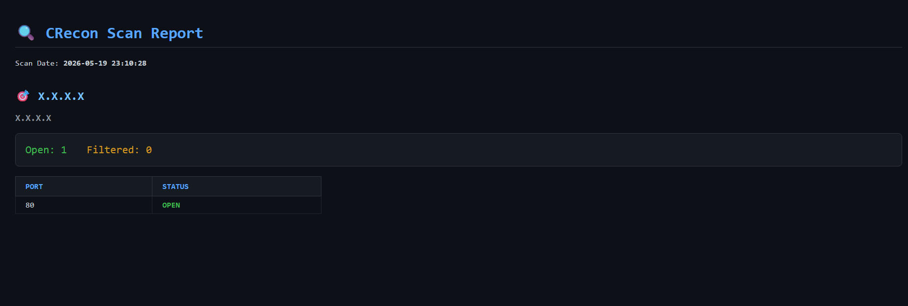

# 🔍 CRecon — A TCP Port Scanner in C

> Built from scratch in C as part of a journey into cybersecurity and low-level network programming.

---

## About

CRecon is a lightweight TCP port scanner written in pure C. It resolves hostnames via DNS, connects to target ports using non-blocking sockets, and classifies each port as `OPEN`, `CLOSED`, or `FILTERED` — similar to how tools like `nmap` work internally.

The project was built to deeply understand:

- TCP socket programming
- Non-blocking network I/O
- Connection multiplexing with `select()`
- DNS resolution with `getaddrinfo()`
- Network reconnaissance concepts
- Systems programming and memory management in C

---

## Screenshots

### Open Ports Detected


### Multiple Targets


### HTML Report Output



---

## Features

- Scan single or multiple targets
- Supports both IP addresses and hostnames
- Automatically resolves hostnames to all associated IPs
- Non-blocking socket scanning using `select()`
- Simultaneous scanning of all ports
- Port classification:
  - `OPEN`
  - `CLOSED`
  - `FILTERED`
- Custom port selection using `-p`
- Multiple output formats:
  - Terminal text output
  - HTML report generation
- Timestamped HTML reports

---

## Usage

### Single Target

```bash
./crecon 192.168.1.1
```

### Multiple Targets

```bash
./crecon google.com 192.168.1.1
```

### Specific Ports

```bash
./crecon 192.168.1.1 -p 80 443
```

### Port Range

```bash
./crecon 192.168.1.1 -p 1-1024
```

---

## Output Options

### Plain Terminal Output

```bash
./crecon 192.168.1.1 -o t
```

Displays scan results directly in the terminal using a clean text-based format.

---

### HTML Report Output

```bash
./crecon 192.168.1.1 -o h
```

Generates a timestamped HTML report:

```bash
crecon_YYYY-MM-DD_HH-MM-SS.html
```

Example:

```bash
crecon_2026-05-19_21-34-11.html
```

The report is automatically saved in the current working directory and can be opened in any web browser.

---

## Build

```bash
git clone https://github.com/Kshitij-jj/CRecon
cd C
make
```

### Dependencies

None — built entirely with:

- POSIX sockets
- Standard C libraries
- Linux networking APIs

### Tested On

- Kali Linux
- Ubuntu

---

## Project Structure

```text
C/
├── src/
│   ├── main.c        # Entry point and scan orchestration
│   ├── scanner.c     # Non-blocking TCP scanning engine
│   ├── input.c       # Argument parsing and DNS resolution
│   ├── output.c      # Terminal and HTML output generation
│   └── helper.c      # Utility helpers and memory cleanup
│
├── include/
│   ├── common.h
│   ├── scanner.h
│   ├── input.h
│   ├── output.h
│   └── helper.h
│
├── outputs/          # Screenshots / generated reports
└── Makefile
```

---

## How It Works

### Why Sequential Scanning Is Slow

A naive scanner checks one port at a time:

```text
connect(port 1) → wait 1s → result
connect(port 2) → wait 1s → result
...
connect(port 1024) → wait 1s → result
```

Scanning 1024 ports with a 1-second timeout can take roughly:

```text
1024 seconds ≈ 17 minutes
```

Every connection blocks execution until success or timeout.

---

## CRecon's Approach — Non-blocking + `select()`

CRecon scans all ports simultaneously using non-blocking sockets.

```text
Create all sockets
connect() on every port
select() waits for responses
Check socket state
Generate report
```

### Internal Workflow

1. Make sockets non-blocking

```c
fcntl(sockfd, F_SETFL, O_NONBLOCK);
```

2. Start asynchronous connections

```c
connect(sockfd, ...);
```

Returns immediately with:

```text
EINPROGRESS
```

3. Monitor sockets with `select()`

```c
select(maxfd + 1, NULL, &writefds, NULL, &timeout);
```

4. Determine connection result

```c
getsockopt(sockfd, SOL_SOCKET, SO_ERROR, ...);
```

### Port Classification

| Result                | Meaning  |
| --------------------- | -------- |
| `SO_ERROR == 0`       | OPEN     |
| `ECONNREFUSED`        | CLOSED   |
| Timeout / No response | FILTERED |

---

## Example Scan Flow

```text
Targets
   ↓
DNS Resolution
   ↓
Create Non-blocking Sockets
   ↓
connect()
   ↓
select()
   ↓
getsockopt()
   ↓
OPEN / CLOSED / FILTERED
   ↓
Terminal or HTML Report
```

---

## Roadmap

- [x] Single target scanning
- [x] Multiple target scanning
- [x] Custom port ranges via `-p` flag
- [x] Non-blocking sockets with `select()`
- [x] HTML report output via `-o` flag
- [ ] Multithreaded scanning (thread pool)
- [ ] Banner grabbing (service detection)
- [ ] UDP scan support
- [ ] OS fingerprinting

---

## Legal Disclaimer

> This project is intended strictly for educational purposes and authorized security testing.
>
> Unauthorized scanning of networks or systems without explicit permission may violate laws and regulations.
>
> Always obtain proper authorization before performing any security assessment.

---

## Author

**Kshitij**

Built while learning:

- Cybersecurity
- TCP/IP networking
- Linux systems programming
- Non-blocking socket architectures
- Reconnaissance tooling

> _"To truly understand security tools, build them yourself."_

---

## Learning Resources

- [Beej's Guide to Network Programming](https://beej.us/guide/bgnet/)
- [Nmap Network Scanning](https://nmap.org/book/)
- [TCP/IP Illustrated — W. Richard Stevens](https://www.amazon.com/TCP-Illustrated-Protocols-Addison-Wesley-Professional/dp/0321336313)
- [The Linux Programming Interface](https://man7.org/tlpi/)
